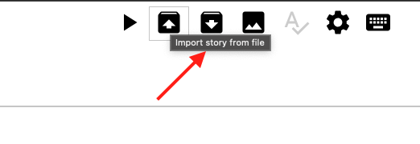
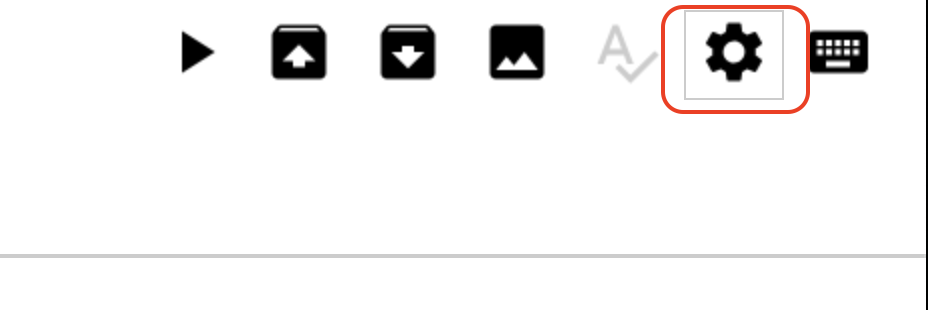
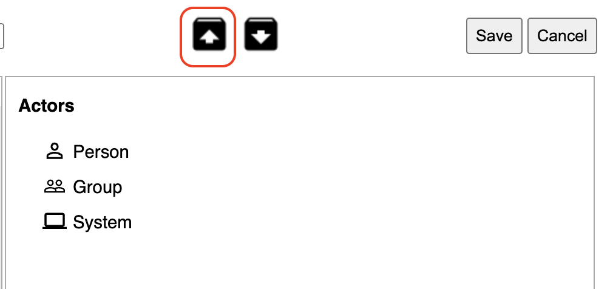

# Preparing your environment

Most of the workshop exercises involves usage of tools such as: 
- Developer IDE (e.g. VSCode, Eclipse, IntelliJ, ...)
- Egon.io
- CLI tools via terminal 

## Prerequisites

* Maven CLI;
* Git CLI;
* Java 17;
* An IDE of your preference;
* Command line (terminal). _If using Windows, PowerShell is recommended;_
* REST client tools like cURL or postman _(Optional)_;

```shell
java -version
mvn -version
git --version
```

To validate your environment, confirm you have as an output of the commands above working:
```shell
$ java -version
openjdk version "17.0.6" 2023-01-17
OpenJDK Runtime Environment Temurin-17.0.6+10 (build 17.0.6+10)
OpenJDK 64-Bit Server VM Temurin-17.0.6+10 (build 17.0.6+10, mixed mode)


$ mvn -version
Apache Maven 3.9.0 (9b58d2bad23a66be161c4664ef21ce219c2c8584)
Maven home: /opt/homebrew/Cellar/maven/3.9.0/libexec
Java version: 19.0.2, vendor: Homebrew, runtime: /opt/homebrew/Cellar/openjdk/19.0.2/libexec/openjdk.jdk/Contents/Home
Default locale: en_BR, platform encoding: UTF-8
OS name: "mac os x", version: "13.0.1", arch: "aarch64", family: "mac"


$ git --version
git version 2.37.1 (Apple Git-137.1)
```

## Prepare your working directory

To get started with the labs, first you need to clone the projects used in the exercises and have it available in your 
local development environment.

!!! INFO

	The guided exercises are built on top of quickstart projects, a foundation set of preconfigured projects.

To get the foundation projects and build them, execute: 

```shell
git clone https://github.com/ultimate-engineer/ddd-workshop-labs
cd ddd-workshop-labs
mvn clean package
```

The build and packaging should complete successfully.

## Using Egon for Domain Modeling

In this workshop, you will use Egon.io to model the domain and its elements throughout the exercises. 

Throughout the exercises, you will handle different use cases in different domains. Each domain is represented in a 
different diagram.  



During the exercises, you'll be instructed to import the respective diagram files in Egon. The file ends with `.
dst` extension, and once imported, you'll have in Egon preconfigured diagram with icons and elements settings.

### (Optional) Extra icons and configurations 

The workshop uses extra icons not available by default in the tool. In case you want to add extra icons or change 
the icon's type (e.g. from `Actor` to `WorkObject` ) you can do that in the tool's settings. 
See details below:

1. Using your browser, navigate to https://egon.io/app/
2. In the top-right corner, click on the **Settings** icon;
   
3. Now, you can upload the icons of our domain:
   1. Click on the **"Upload Custom Icons"** button;
   2. Locate the `ddd-workshop-labs` project you have cloned on the previous step. 
   3. Select and upload your custom icon, or all icons located in the directory:
      ```ddd-workshop-labs/storytelling/icons```
4. Now, upload the icons settings. Each icon can be configured to be used as an `actor` or a `work object`. These 
   settings are already configured for you. Click on the *"import icon configuration"* icon:
   
5. Save your configurations.  

